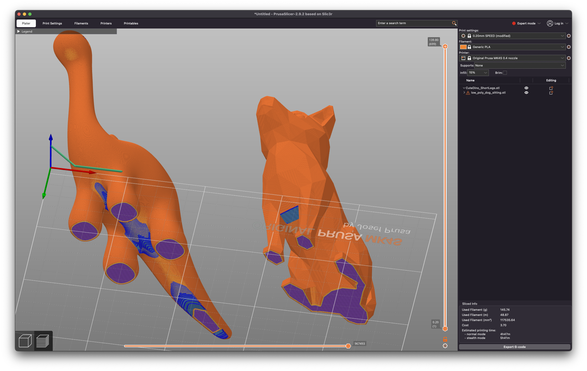
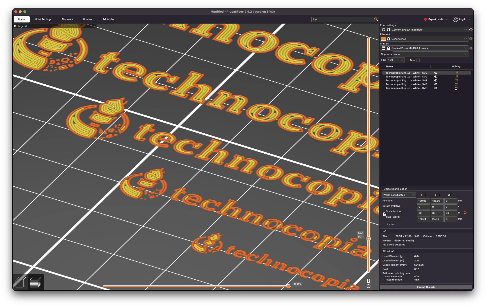

# Prerequisites

Students are strongly encouraged to install PrusaSlicer on their personal computers.
# The Basics

### What will we cover today?
- Preparing a Prusa MK4S and a 3D model for printing.
### What won't we cover today?
 - Making your own 3D models for printing.
 - Resin printing
 - Multi-material printing
### What is 3D Printing?
All 3D printing is layers. In a FDM (or FFF) 3D printer, a long string of plastic is fed into the nozzle. The nozzle heats the plastic and deposits it in lines to trace the shape of layers. The plastic is then rapidly cooled to provide a solid foundation for the next layer. 
### Setting Up a Successful Print
- flat on the bed
- overhangs
	- Two models, oriented correctly to the build plate, seemingly fine. 
	- If we look at the bottom, we can see large areas of unsupported plastic. In Slice Mode, PrusaSlicer highlights them in blue. 
	- We can go to the right side of the screen and change "Supports" from "None" to "On Build Plate" and re-slice. This generates a scaffolding for the previously unsupported plastic. The scaffolding is colored green in this image. 
	- Here are the models shown once again from the front, now with Supports enabled. 
- details should be no less than the nozzle size 
- parts are weakest vertically -- they'll split between layers if force is applied vertically
- Print failures happen. That's life. Sometimes they even break the machine. That's life. If it's clear the user didn't follow procedure, there may be further action taken.
### Safety

* 3D prints are **NOT** waterproof
* 3D prints are **NEVER** food safe, despite material datasheets or manufacturer claims
* Never touch a moving machine. This one's obvious but important.
* Melted plastic is hot. This one's should also be obvious.
* Always look on-screen to check the temperature of the bed before touching the machine. (These are in Celsius).
- On Prusa machines, the emergency stop is located directly below the knob.
  
  

# Our Printers
This training will cover the use of our two Prusa MK4S printers. Treat these as the default, and make every effort to print on these. One MK4S is soon to be equipped with an automatic material changer for multi-color prints. Incoming we have a Voron 300 for larger prints. 
# Parts of a 3D Printer
- The Toolhead
	- At the bottom of the toolhead is the nozzle, which deposits the melted plastic.
	- Surrounding the nozzle is a fan to cool the deposited plastic.
	- Above that fan is another fan to cool the toolhead itself.
	- At the top of the toolhead -- under the "Prusa" cover -- is the extruder. This grabs the filament and pushes it through the nozzle.
	- In exceedingly rare situations, the idler release is on the left of the extruder if there are problems unloading filament.
- The Heated Bed
	- On our MK4 printers, and other printers of this style, the bed moves to allow the toolhead to reach different parts of the work surface. This movement shakes the whole work piece, so it's important to keep that in mind when orienting narrow objects.
	- The steel sheet is removable from the printer. Do not print without the sheet!

# Materials
Three main materials. PLA, PETG, ABS.
- PLA for ease of printing, will melt in a hot car. 
- ABS is strong and resilient, but really hard to print. 
- PETG is a good balance for most applications.

# PrusaSlicer

### PrusaSlicer Setup
- first time setup
	- config source selection
	- prusa printer selection
	- filament selection
- At the top left of the screen, we have the option to select between Beginner, Advanced, and Expert. We'll leave this setting on Beginner for now. If you use the shop PC and find yourself drowning in settings, make sure this is set back to Beginner.
### Setting up a Print Job
- **Presets:** On the right side of the screen, select your printer. We'll be selecting the Prusa MK4S. Then select the correct filament. If your filament is not listed, select "Add/Remove Filaments". Lastly, select a preset. We'll be using "0.20mm Speed".
- **Importing a model:** We can import a model in the File > Import menu, or simply drag a file onto the build plate.
- **Place on Face:** Some models will import right side up on the build plate. For other models, we can use the Place on Face tool. Generally this should be a large, flat surface.
- **Rotate:** For large models or models that risk shaking off the plate, use the Rotate tool to turn them the desired direction.
- **Arrange:** If you've imported multiple models, you can use the Arrange tool to lay all models out on the build plate. Typically the software will arrange them as close as possible to one another so that the toolhead has less far to move between parts.

### Viewing the Sliced Output
- **Slice:** Once you're ready, click Slice in the bottom right, and the software will convert the models into a series of movements for the printer. This file is called GCODE and contains only the machine instructions, and no detail about the models themselves.
- Slicing automatically brings us from Editor view to Preview. The slider on the right allows you to view each layer of the print. You can use this to check for floating overhangs that you may have missed before.
- At the bottom left of the screen, you can toggle back to the Editor view to make changes to the position of the models.
- When you're happy with the output, insert a flash drive into your machine. The drives here have both USB-C and USB-A for maximum compatibility.

# Running a Print
### Prepare the Bed
To prepare the bed for printing:
  1. Ensure a steel sheet is present. Do not operate the printer with the heater exposed.
  2. Squirt alcohol onto a paper towel and wipe the bed clean. The alcohol will dry on its own as the bed heats up.

### Load Your Filament
- never let go of the end of the filament
- select
- snip at angle
- feed through tube

1. Pretty often you'll find the previous user's filament still loaded. On the home screen of the printer, select FIlament > Change Filament.
2. Follow the instructions on the screen. When the machine prompts you to do so, pull the filament all the way out of the long feeder tube. Make sure not to let go of the end as you roll it onto the spool. Along the outer edge of the spool, there will be slots to hold the end for storage.
3. Select Filament > Load Filament and select your filament from the list of filament types.
4. With the cutters, cut your filament at an angle as shown. ==Instructor: Have a picture ready of a properly cut filament end.==
5. Place your filament roll on the holder, and push the end into the tube, as marked by the arrow.
6. Continue pushing the filament through the tube until the printer acknowledges the new filament has been loaded.

### Run the File

1. Insert the flash drive in the USB port on the right side of the screen.
2. The printer will load the newest file on the drive. 
3. The printer will display an error for common mistakes (such as if the file was sliced for a different printer model, nozzle, or filament).

# Finished Prints
### Removing Your Print
Wait until the bed has cooled to 50 Celsius or less. You can see the current temperature on the screen. Use the tabs at the front to lift the steel sheet from the bed. Gently flex the steel sheet to release the part.

### Removing your filament
To remove your filament, select Filament > Unload Filament and follow the instructions on the screen. As before, make sure to not let go of the end and to place it within the slots on the spool for proper storage.

# Congratulations
You've just completed Introduction to 3D Printing with FDM.
